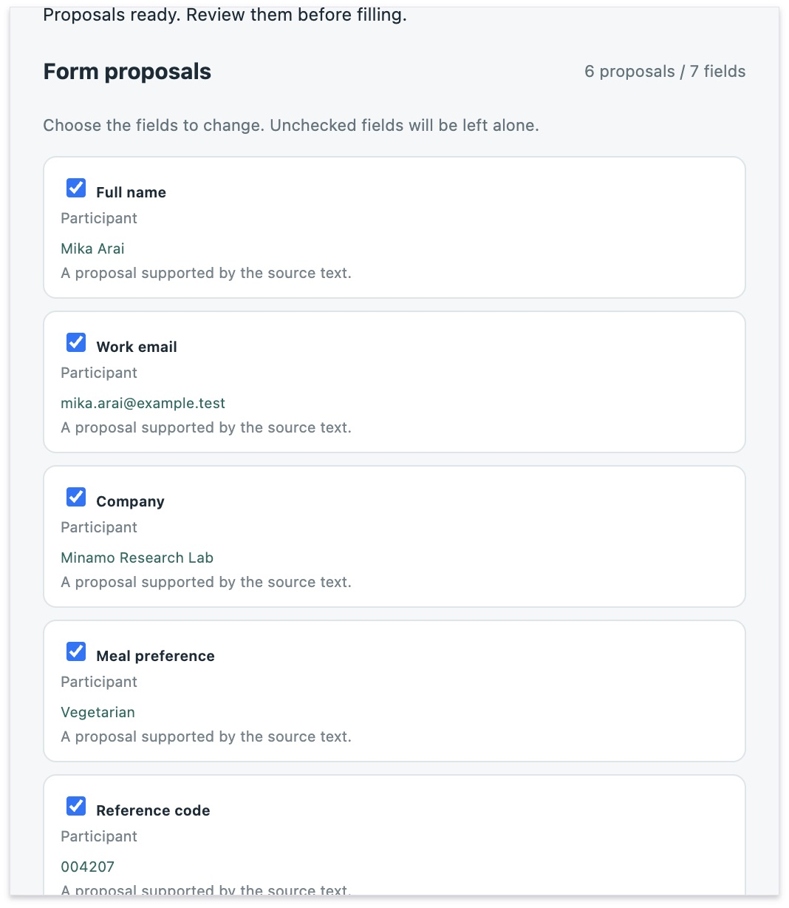
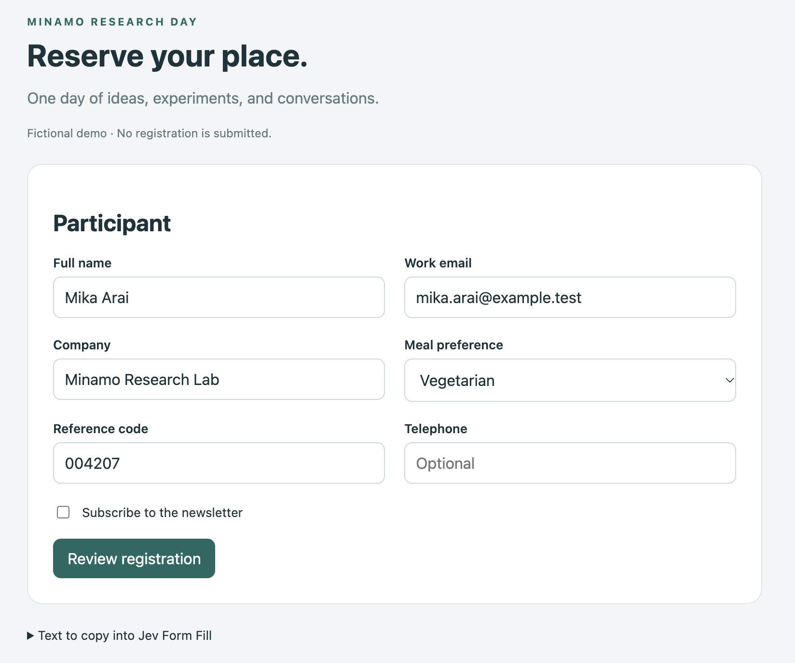

# Jev Form Fill

[English](README.md) · 日本語

クリップボードの文章から、現在のページのフォームに入力候補を作るChrome拡張です。項目名・見出し・選択肢を元の文章に対応付け、候補を確認してからDOM順に入力します。文章に書かれていない値は見送ります。明示された空欄やオフにも対応し、直前の入力を戻せます。フォームは自動送信しません。

**試用版 v0.2.0。TypeSafeのAPIキー、またはCloudflare Workers AIのAPIトークンとAccount IDが必要です。候補の作成時に文章とフォーム情報を選んだ接続先へ送信し、API利用料が発生する場合があります。** [データの扱い](PRIVACY.ja.md)を確認してください。

## 利用イメージ



クリップボードから元の文章を読み、候補を確認して必要な欄だけに入力します。下の画像は、実際のChrome拡張と架空の登録フォームでの入力結果です。



表示言語はブラウザに合わせて英語・日本語を選びます。拡張上部のLanguage／表示言語でも切り替えられます。フォームの項目名や入力値は翻訳しません。

## インストール

Chrome 116以上が対象です。ビルドやNode.jsのインストールは不要です。GitHubから配布するソースをローカルで読み込む方式です。

1. リポジトリをダウンロードして展開します。配布用ZIPを使う場合は、ZIP内の `jev-form-fill` フォルダを展開します。
2. Chromeで `chrome://extensions` を開き、右上の「デベロッパーモード」をオンにします。
3. 「パッケージ化されていない拡張機能を読み込む」を押し、`manifest.json` があるフォルダを選びます。
4. ツールバーの拡張機能メニューから「Jev Form Fill」を開きます。必要なら固定します。

ソースリポジトリから配布用ZIPを作る場合は、`npm run package` で作った `dist/jev-form-fill.zip` を展開し、中の `jev-form-fill` フォルダを手順3で選びます。

更新時は読み込み元フォルダの内容を更新し、`chrome://extensions` で拡張を再読み込みしてください。

## 使い方

1. 設定値やメモをコピーし、入力先のページを開きます。
2. 拡張を開き、「クリップボードから読む」を押します。文章欄への手動貼り付けもできます。
3. 「接続先とキーの設定」で接続先（TypeSafe または Cloudflare Workers AI）を選び、キーを入力します。Cloudflare Workers AIではAPIトークンと32文字のAccount IDを入力します。
4. 「TypeSafeへ送って候補を作る」（Cloudflare Workers AIを選んだ場合は「Cloudflare Workers AIへ送って候補を作る」）を押します。処理中はポップアップを開いたままにしてください。
5. 候補を確認し、変更したくない項目のチェックを外して「選んだ項目に入力」を押します。既存の値も、選んで適用すれば書き換わります。
6. 適用結果とページ側の値を確認し、フォームの送信はご自身で行います。「直前の入力を戻す」で最後の書き換えを取り消せます。

適用後の失敗は**拡張のポップアップ内**に件数と理由を表示します。フォーム上に目印は付けません。「ページが値を受け付けませんでした」「入力後にページが値を変更しました」は入力失敗です。ポップアップを閉じると表示は消えます。適用後の「0件の候補」は、未適用の候補が残っていないという意味です。

入力に応じて新しい欄が現れた場合は、もう一度候補を作ってください。分析後に手入力した値や、意味・選択肢が変わった項目は適用を見送ります。Undoでも後から手で編集した値は残します。ページ移動・再読み込み・拡張の再読み込みで候補とUndo情報は失われます。

## 対応範囲

| 対応 | トップレベル文書のinput（text・email・tel・url・search・number・date・time・datetime-local・checkbox・radio）、textarea、単一選択select |
| --- | --- |
| 対象外 | password、file、hidden、month・week・range・color、disabled・readonly、送信ボタン、複数選択select、iframe、shadow DOM、contenteditable、ネイティブ入力要素のない独自UI |
| 元文章の上限 | 12,000文字・120行、1回の分析は160項目まで |
| 値の扱い | 元文章の引用値または一行の範囲をそのまま切り出す。複数行の合成、言い換え、日付計算はしない |

- radioは同名・同一formのグループ全体を扱える場合だけ操作します。一部の選択肢がdisabledなどの場合は見送ります。
- ネイティブ `details` は読み取り時だけ開いて元に戻します。それ以外の折りたたみは、ご自身で開いてから分析してください。
- credential・paymentらしい名前のテキスト欄も除外しますが、判定はヒューリスティックです。元文章の秘密情報を自動除去しません。
- 値の範囲選択は一行240トークンまでです。多数の選択肢や長い文章はAPIの文脈上限に達する場合があります。
- 設定後に読戻しを行い、全項目への適用後に650ms待って再確認します。それ以降の変更は継続監視しません。
- Jevの判定には揺れがあります。同じ文章・フォームでも毎回同じ候補になる保証はありません。候補と入力後の値を確認してください。

## データと費用

解析先はTypeSafeの `https://api.typesafe.ai/v1/systemone`、モデルは `jev-latest` です。元の文章と対象項目の名前・見出し・型・選択肢を送ります。既存の入力値、Cookie、ページURL、ページ本文全体は解析要求に含めません。項目名・見出しに含まれる個人情報は送られます。アクセス解析はありません。

接続先にCloudflare Workers AIを選んだ場合は、送信先が `https://api.cloudflare.com/client/v4/accounts/{Account ID}/ai/run/@cf/cloudflare/clef-flash`、モデルがClef（`clef-flash`）になります。送る内容はTypeSafeの場合と同じです。キー・トークンは接続先ごとに分けて保持し、選んだ接続先のものだけを送ります。

8項目ずつ分析し、1バッチあたり1〜4回のAPI要求を行います。HTTPエラーの自動再試行はしません。APIキーは通常、開いているポップアップ内だけに保持します。保存を明示した場合だけ `chrome.storage.local` に保存します。詳細は [PRIVACY.ja.md](PRIVACY.ja.md) を参照してください。

権限は `activeTab`、`scripting`、`storage`、`clipboardRead` と、TypeSafe・CloudflareのAPIホストのみです。

## 試験と開発

開発・試験・ZIP作成は、[ソースリポジトリ](https://github.com/takasek/jev-form-fill)をダウンロードまたはcloneし、そのルートで実行してください。配布用ZIPには開発・試験用のファイルを含めません。Node.js 22以上で実行できます。テストはモデル回答とChrome APIを模擬し、実APIやAPIキーは使いません。

```sh
npm ci --ignore-scripts
npm test
```

架空のイベント登録フォームで、同名欄、空欄・オフ、先頭ゼロ、動的欄、偽指示、サイトによる値の書き戻しなどを試せます。

```sh
node lab/server.js --port 0
```

表示されたURLをChromeで開きます。サーバーは127.0.0.1だけで待ち受け、送信結果をGit管理対象外の `.local/form-fill-lab/receipts/` に保存します。詳しくは [試験フォームの使い方](https://github.com/takasek/jev-form-fill/blob/main/lab/README.md) と [検証結果・限界](https://github.com/takasek/jev-form-fill/blob/main/docs/validation.md) を参照してください。

GitHub Appの設定例も [examples/](https://github.com/takasek/jev-form-fill/tree/main/examples) にあります。実際のGitHub App作成画面での入力互換性は未検証です。

配布用ZIPはPython 3.9以上で作成できます。

```sh
python3 -m unittest discover -s scripts -p 'test_*.py'
npm run package
```

ZIPには拡張の実行ファイル、英語・日本語のREADMEとプライバシー説明、スクリーンショット、ライセンスを入れます。試験サーバー、受信データ、依存ライブラリ、APIキーは含めません。既存のZIPは上書きしないため、再作成時は先に対象ファイルを移動してください。

## 仕組みと資料

根拠の行と完全な引用値を候補として選び、全文に照らすNoul確認を経て入力可能にします。引用されていない値は始点・終点から元文字列を切り出します。空欄・オフは、情報欠落とは別の明示指示として確認します。しきい値はアプリの暫定方針で、正確さの実測値ではありません。

- [TypeSafe API](https://docs.typesafe.ai/api)、[Choice](https://docs.typesafe.ai/primitives/choice)
- [Cloudflare Workers AI](https://developers.cloudflare.com/workers-ai/)
- [Chrome activeTab](https://developer.chrome.com/docs/extensions/develop/concepts/activeTab)、[scripting](https://developer.chrome.com/docs/extensions/reference/api/scripting)
- [Chromeの拡張読み込み](https://developer.chrome.com/docs/extensions/get-started/tutorial/hello-world#load-unpacked)

MIT License。TypeSafeの公式製品ではありません。
